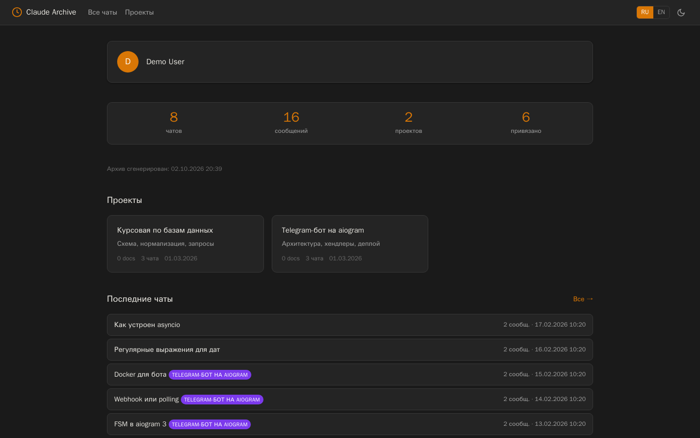
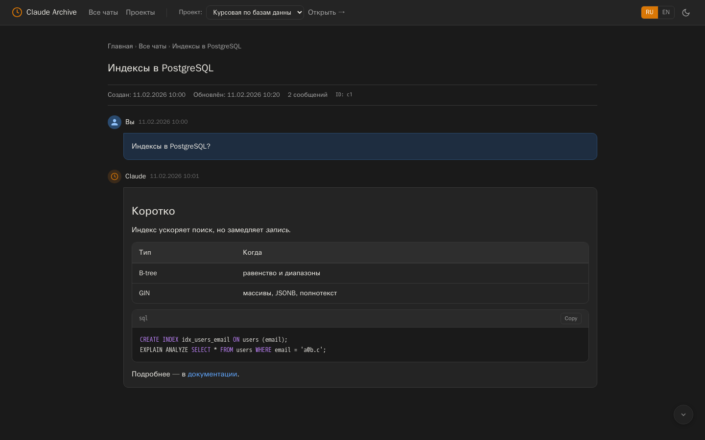
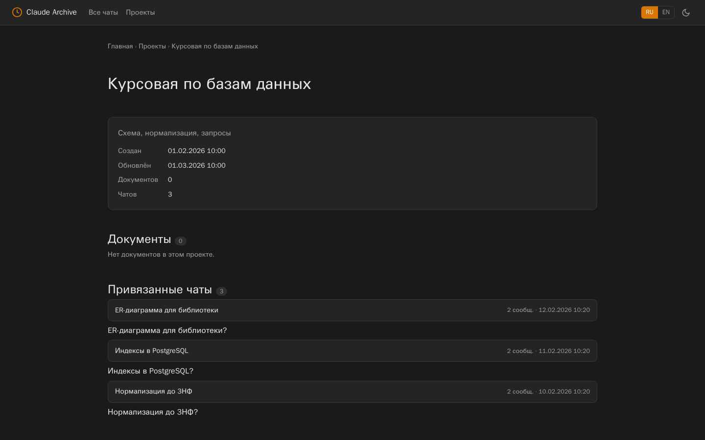

# declaude

**Русский** · [English](README.en.md)

[](https://github.com/EDeev/declaude/actions/workflows/ci.yml)
[](https://pypi.org/project/claude-export-html/)
[](https://pypi.org/project/claude-export-html/)
[](LICENSE)

Превращает экспорт данных Claude.ai в статический HTML-архив: все чаты и проекты можно листать,
искать и читать в браузере без интернета, серверов и баз данных.

**Статус:** личный проект, работает · онлайн-версия на [fe0.ru/declaude](https://fe0.ru/declaude/)



**Стек:** Python 3.9+ (только стандартная библиотека) · HTML · CSS · vanilla JS

## Возможности

- Отдельная страница на каждый чат и проект, главная со статистикой и последними чатами
- Markdown: заголовки, списки, таблицы, цитаты, код с подсветкой (Python, JS/TS, SQL, Bash, Go, Rust)
- Поиск и фильтр по всем чатам, светлая и тёмная тема, интерфейс на русском и английском
- Привязка чатов к проектам прямо в браузере с выгрузкой `mapping.json`
- Инкрементальное обновление из нового экспорта: пересобираются только изменённые чаты
- Ссылки из чатов безопасны: `javascript:` и подобные схемы не попадают в архив

## Установка

```bash
pipx install claude-export-html      # или: pip install claude-export-html
```

Не хочется ничего ставить — загрузите zip на [fe0.ru/declaude](https://fe0.ru/declaude/). Если важна
приватность, запускайте локально.

## Использование

1. Claude.ai → **Settings → Privacy → Export data**, скачайте zip из письма и распакуйте.
2. Соберите архив и откройте `claude_archive/index.html`:

```bash
declaude --build --source ./claude-export
declaude --build --source ./claude-export --output ./my-archive   # своя папка
declaude --update new_export.zip                                  # добавить новый экспорт
declaude --map <conversation_uuid> <project_uuid> && declaude --remap
```

| Параметр | Назначение |
|---|---|
| `--build` | полная сборка из распакованного экспорта |
| `--source ПУТЬ` | папка с экспортом (по умолчанию `claude-backup-v1`) |
| `--output ПУТЬ` | куда сложить архив (по умолчанию `claude_archive`) |
| `--update ZIP` | добавить данные из нового zip, привязки к проектам сохраняются |
| `--map ЧАТ ПРОЕКТ`, `--remap` | привязать чат к проекту и пересобрать главную и проекты |
| `--mapping ПУТЬ` | файл привязок (по умолчанию `./mapping.json`) |

Вместо команды `declaude` можно запускать `python -m declaude`.

> [!NOTE]
> Архив — обычные HTML-файлы, данные никуда не отправляются. Выбор темы и языка хранится в
> localStorage браузера.

## Как выглядит

| Чат | Проект |
|---|---|
|  |  |

## Использование из Python

```python
from pathlib import Path
from declaude import DataLoader, MappingManager, SiteBuilder

loader = DataLoader(Path("claude-export")); loader.load()
mapping = MappingManager(Path("mapping.json")); mapping.load()
SiteBuilder(Path("archive"), loader, mapping).build_all()
```

Так библиотека встроена в веб-версию на fe0.ru — заметки об интеграции в FastAPI:
[docs/fastapi-integration.md](docs/fastapi-integration.md).

## Разработка

```bash
pip install -e . -r requirements-dev.txt
ruff check . && pytest
```

Тесты собирают архив из вымышленного экспорта в `tests/fixtures` и проверяют страницы, Markdown,
экранирование и защиту ссылок. CI гоняет их на Python 3.9–3.13; на каждый тег `v*` пакет публикуется
на PyPI.

## Лицензия

MIT — см. [LICENSE](LICENSE).

## Автор

**Деев Егор Викторович** — [GitHub](https://github.com/EDeev) · [Telegram](https://t.me/DeevEgor) · [egor@deev.space](mailto:egor@deev.space)

---

<div align="center">
  <sub>⭐ Если проект оказался полезным, поставьте звёздочку на GitHub!</sub>
  <p><sub>Сделано с ❤️ — <a href="https://deev.space">deev.space</a></sub></p>
</div>
